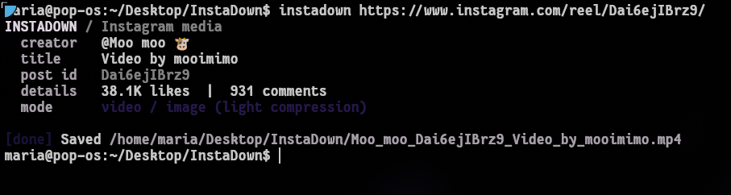

# instadown

`instadown` is a fast Rust CLI for downloading Instagram posts and reels. It shows
post metadata and saves media in the
current directory with shell-friendly filenames.

## Features

- Download public reels, image posts, and mixed-media carousels
- Download audio as MP3 with `--audio`
- Include video and audio in video downloads
- Use light compression by default for smaller files
- Keep the best available quality with `--no-compress`
- Use browser cookies for posts that require a login
- Show creator, caption, engagement, and download progress

## Requirements

- Rust 1.85 or newer
- [yt-dlp](https://github.com/yt-dlp/yt-dlp)
- [FFmpeg](https://ffmpeg.org/)

On Ubuntu and similar distributions:

```bash
sudo apt install ffmpeg pipx
pipx install yt-dlp
```

Keep `yt-dlp` updated because Instagram changes frequently:

```bash
pipx upgrade yt-dlp
```

## Install

Clone the repository, enter its directory, and run:

```bash
cargo install --path .
```

Confirm the installation:

```bash
instadown --version
```

## Release binaries

Every release includes prebuilt binaries for:

- Linux x86_64
- macOS Apple Silicon
- macOS Intel
- Windows x86_64

Download `install.sh` from the latest release on Linux or macOS, then run:

```bash
sh install.sh
```

On Windows, download `install.ps1` and run it in PowerShell:

```powershell
powershell -ExecutionPolicy Bypass -File .\install.ps1
```

The installers place `instadown` in a user-local directory. `yt-dlp` and FFmpeg must
still be installed separately.

## Usage

Download a post or reel:

```bash
instadown <url>
```

Download audio only:

```bash
instadown --audio <url>
```

Keep the best available quality:

```bash
instadown --no-compress <url>
```

Use cookies from a logged-in browser:

```bash
instadown --cookies-from-browser firefox <url>
```

Run `instadown --help` for the complete command reference.



## Output

Files are saved in the directory where the command is run. 

```text
HYPEWHIP_DbDW-49haLj_Video_by_hypewhip.mp4
```

Default video downloads use Instagram's rendition capped at 1280 pixels on the long
edge, normally 720p. This reduces file size without a slow local re-encode.
`--no-compress` downloads the best available resolution instead.

Images and carousel items are downloaded at the highest source resolution exposed by
Instagram. Mixed carousels preserve their original order with numbered filenames.

## Login and rate-limit errors

Public posts normally work without an account. If Instagram requires a login, pass
cookies from a browser where you are already signed in:

```bash
instadown --cookies-from-browser firefox <url>
```

Some Linux distros may store Firefox profiles in a nonstandard location:

```bash
instadown --cookies-from-browser firefox:$HOME/.config/mozilla/firefox <url>
```

If a public post unexpectedly fails, update `yt-dlp` before retrying.

## Legal

Only download media that you own or have permission to use. You are responsible for
following Instagram's terms and applicable copyright laws.

## License

MIT
